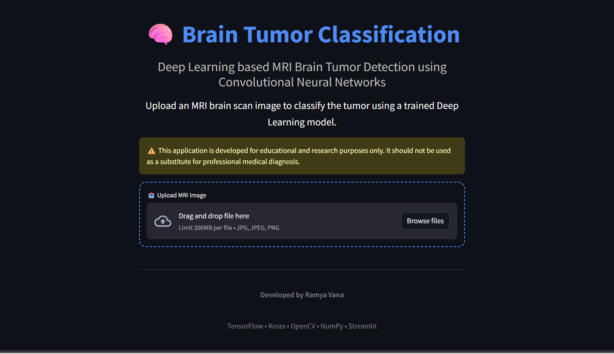

**🧠 Brain Tumor Classification using CNN**

A Deep Learning project that classifies brain MRI images into four categories using a Convolutional Neural Network (CNN).

## 🚀 Live Demo

https://brain-tumor-classification.streamlit.app

**📌 Project Overview**

This project uses MRI brain scan images to classify tumors into one of four classes:

- Glioma Tumor
- Meningioma Tumor
- Pituitary Tumor
- No Tumor

The model is trained using TensorFlow/Keras and image preprocessing techniques to achieve accurate predictions.

Note: This project is intended for educational and research purposes only. It is not a substitute for professional medical diagnosis.

**🚀 Tech Stack**

- Python
- TensorFlow / Keras
- OpenCV
- NumPy
- Scikit-learn
- Matplotlib
- Jupyter Notebook

## 📸 Application Preview

  

